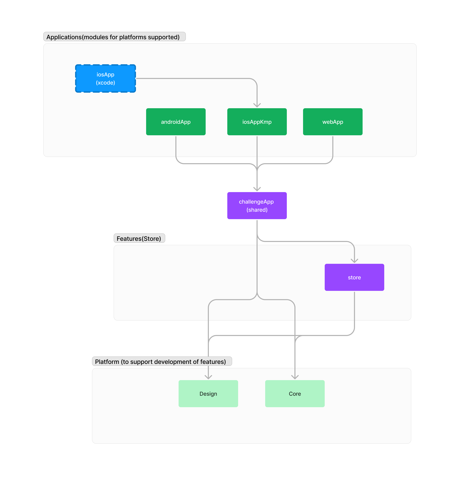
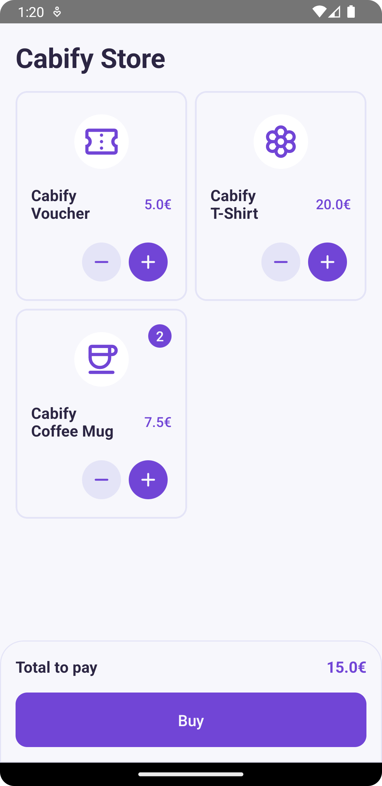
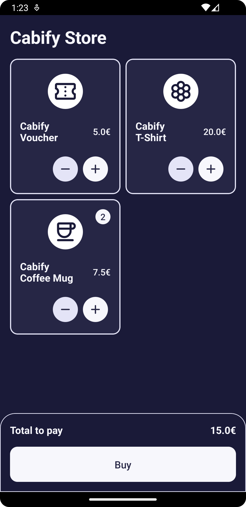
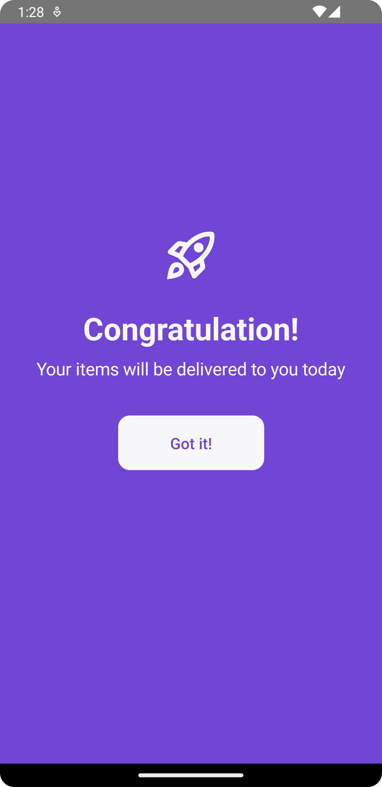
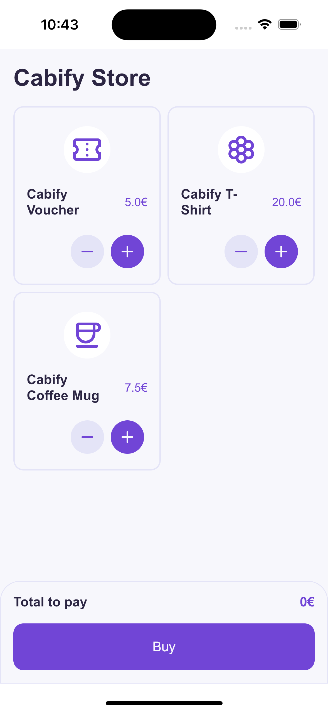
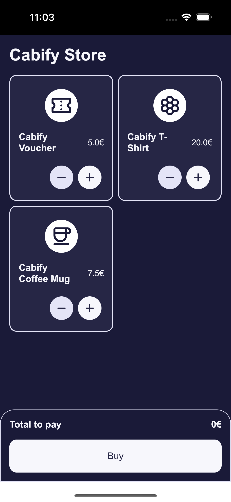
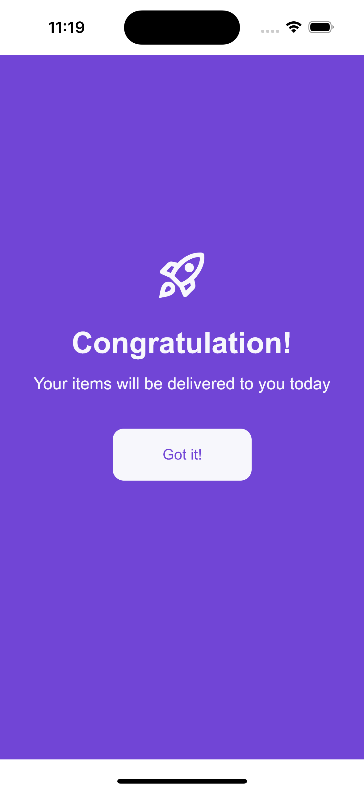
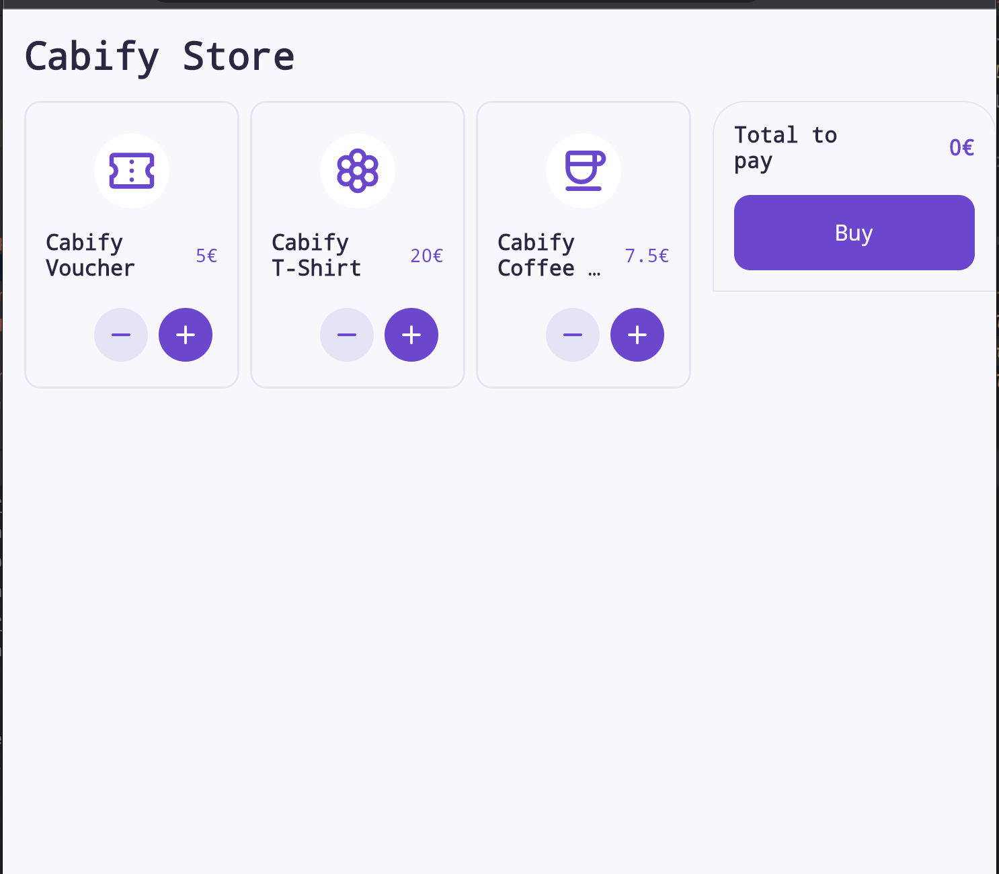
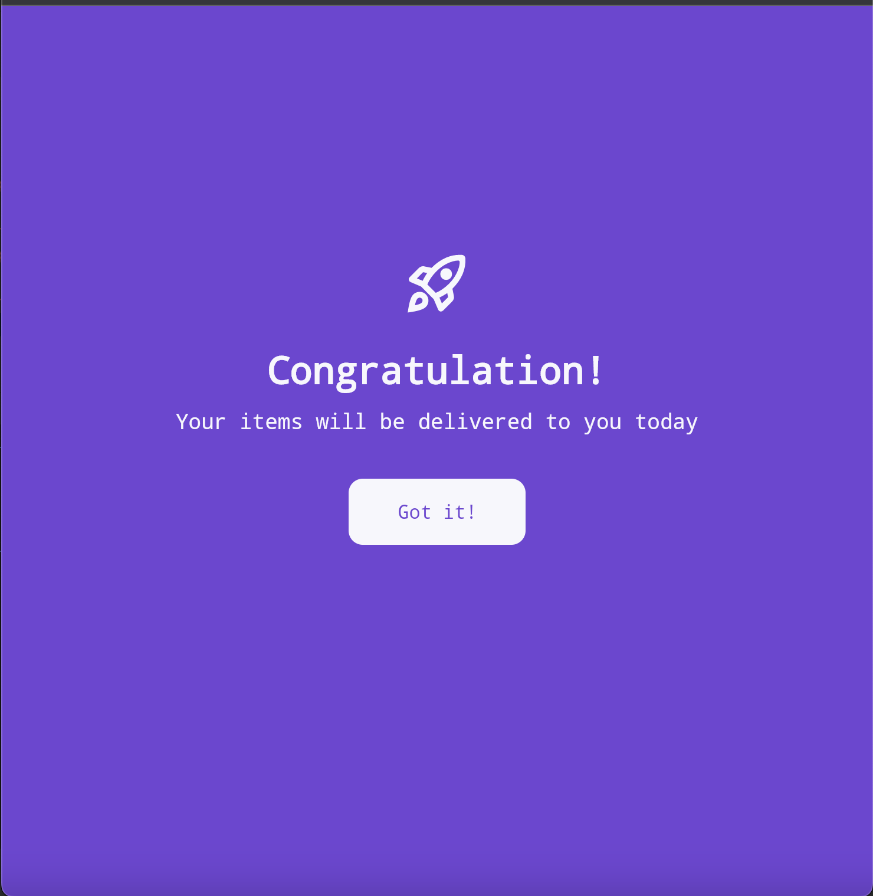

## Setup
 - check your system with (KDoctor)[https://github.com/Kotlin/kdoctor]
 - install JDK 11 on your machine
 - install Android Studio
 - install Kotlin Multiplatform plugin on your android studio
 - install Xcode
 - add `local.properties` file to the project root and set a path to Android SDK there
 - run `./gradlew podInstall` in the project root

### JDK setup
`brew tap mdogan/zulu`

`brew install --cask zulu-jdk11`

`ls /Library/Java/JavaVirtualMachines`

Set a *JAVA_HOME* environment variable

`unset JAVA_HOME`

`export JAVA_HOME=$(/usr/libexec/java_home -v 11)`

## Architectural stuffs
### Stack
- Voyager for multiplatform navigation
- Compose multiplatform for UI
- Ktor for requests
- Kotlin Test and Turbine for tests
- Paparazzi for screenshot tests
- Kotlin Serialization for handle serialize/deserialize responses

### Code organization

## Running Apps

### Android
To run the application on android device/emulator:  
 - open project in Android Studio and run imported android run configuration

To build the application bundle:
 - run `./gradlew :applications:androidApp:assembleDebug`
 - find `.apk` file in `androidApp/build/outputs/apk/debug/challenge-debug.apk`

### iOS
To run the application on iPhone device/simulator:
 - Open `iosApp/iosApp.xcworkspace` in Xcode and run standard configuration
 - Or use [Kotlin Multiplatform Mobile plugin](https://plugins.jetbrains.com/plugin/14936-kotlin-multiplatform-mobile) for Android Studio
If you have some problem with the first build with KMM plugin, please try with XCode
### Browser
Run the browser application: `./gradlew :applications:webApp:jsBrowserDevelopmentRun`

### Resources
| Home                                                                    | Home - Dark                                                           | Rotated                                                                       | Success                                                                                   |
|-------------------------------------------------------------------------|-----------------------------------------------------------------------|-------------------------------------------------------------------------------|-------------------------------------------------------------------------------------------|
|  |  |  |  |
|          |          |              |        |
|          | x                                                                     | x                                                                             |        |
